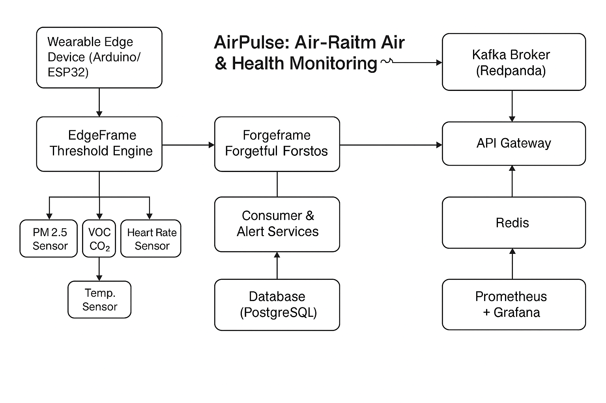

# AirPulse: Real-time Air Quality & Health Monitoring System with EdgeFrame and Forgetful Forest

AirPulse is an enhanced real-time air quality and health monitoring system that integrates wearable IoT sensors with hybrid edge-based intelligence. It uses the EdgeFrame threshold model for on-device decision-making and Forgetful Forest (FF) for adaptive learning in streaming environments.

---

## Table of Contents

- [Overview](#overview)
- [Project Architecture](#project-architecture)
- [Tech Stack](#tech-stack)
- [Key Features](#key-features)
- [Edge Intelligence](#edge-intelligence)
- [Hardware Integration](#hardware-integration)
- [Challenges](#challenges)
- [Installation](#installation)
- [Development Phases](#development-phases)
- [Contributions](#contributions)
- [Monitoring and Observability](#monitoring-and-observability)
- [References](#references)
- [License](#license)

---

## Overview

AirPulse is a hybrid system designed to collect, process, and analyze real-time environmental and physiological data. The platform uses edge-computing principles to locally process data using EdgeFrame logic and adaptively model environmental conditions using Forgetful Forest. Data is selectively transmitted to the cloud for analytics, alerts, and visualization.

---

## Project Architecture

1. **Wearable Edge Device (Arduino/ESP32)**: Captures air quality and health signals (PM2.5, CO2, VOCs, HR, Temp).
2. **EdgeFrame Threshold Engine**: Processes sensor data locally and triggers alerts when thresholds are exceeded.
3. **Forgetful Forest Module**: Learns from incoming data in real-time, adapts to concept drift and evolving conditions.
4. **Kafka Broker (Redpanda)**: Queues data and alerts.
5. **Consumer & Alert Services**: Ingests sensor readings, invokes models, persists alerts.
6. **Database (PostgreSQL)**: Stores sensor data, alerts, and metadata.
7. **Redis**: Caches frequently used analytics data.
8. **API Gateway**: Serves RESTful APIs for visualizations and monitoring.
9. **Prometheus + Grafana**: Monitoring, visualization, and alert dashboards.

---

## Tech Stack

- **Hardware**: Arduino Nano 33 BLE Sense / ESP32, MAX30102, PMS5003, SGP30
- **Languages**: Java 17, C++ (firmware), Python (model training)
- **Frameworks**: Spring Boot 3.2.5, Spring Kafka, Micrometer
- **Messaging**: Kafka (Redpanda)
- **Storage**: PostgreSQL, Redis
- **Visualization**: Grafana
- **Monitoring**: Prometheus
- **ML Integration**: Forgetful Forest (Custom Lightweight Streaming Forest)

---

## Key Features

- **Hybrid edge-cloud architecture**
- **EdgeFrame on-device logic** for instant decision-making
- **Forgetful Forest** streaming ML model for adaptive learning
- **Modular sensor interface** (air + health)
- **Low-power wearable support**
- **Scalable messaging and data handling**
- **RESTful APIs with real-time analytics**
- **Monitoring and visualization using Grafana**

---

## Edge Intelligence

- **EdgeFrame**: Processes incoming data locally on the wearable and evaluates it against pre-configured thresholds. For example, PM2.5 > 100 triggers local alert before cloud sync.
- **Forgetful Forest**: Continuously learns and adapts to real-time air quality trends. Supports streaming updates and pruning of outdated trees to reduce memory.

---

## Hardware Integration

- **Arduino Nano 33 BLE Sense** or **ESP32**
- **PM2.5 Sensor (PMS5003)**
- **VOC/CO2 Sensor (SGP30)**
- **Heart Rate Sensor (MAX30102)**
- **Temperature Sensor (DHT22 or MLX90614)**
- **MicroSD module** for edge logging (optional)
- **BLE/Wi-Fi module** for communication
- **Battery + TP4056** for power management

---

## Challenges

1. **Resource Constraints**: Limited memory/CPU on microcontrollers can hinder model execution.
2. **Sensor Calibration**: Low-cost sensors require periodic calibration.
3. **Data Drift**: Environmental changes can impact model accuracy; hence, FF is used.
4. **Energy Efficiency**: Edge computations must be optimized to preserve battery.
5. **Network Reliability**: Ensure local storage when cloud connection is unavailable.
6. **Security**: Secure data transmission and storage.

---

## Installation

> Installation involves setting up the microcontroller, sensor calibration, flashing EdgeFrame logic, and deploying backend services. Kafka must be initialized with appropriate topics, and Grafana dashboards must be configured with Prometheus data sources.

---

## Development Phases

### Phase 1: Sensor + Edge Setup
- Connect and calibrate sensors
- Implement EdgeFrame logic in Arduino firmware

### Phase 2: Kafka Pipeline
- Integrate BLE/Wi-Fi data transmission to Kafka via gateway

### Phase 3: Forgetful Forest Model
- Design and train streaming-capable model
- Integrate with consumer service for real-time analysis

### Phase 4: Analytics & Dashboard
- REST APIs for device/sensor stats
- Grafana dashboards with Prometheus metrics

---

## Contributions

- ✅ **EdgeFrame Integration** for on-device logic and local threshold monitoring.
- ✅ **Forgetful Forest Model** for dynamic, memory-efficient learning on streaming data.
- ✅ **Scalable IoT architecture** with edge processing, centralized alerting, and cloud analytics.

---

## Monitoring and Observability

- **Grafana Dashboards**:
  - AQI over time
  - Health vitals dashboard
  - Alert history
- **Prometheus Exporters**:
  - Spring Boot Actuators
  - Kafka and database metrics

---

## References

Below are a few scholarly works that helped shape the research direction of AirPulse:

1. **Forgetful Decision Forest for Data Stream Classification**  
   *Mithradevi Kumar, et al.*  
   DOI: [10.1109/TKDE.2024.3288401](https://doi.org/10.1109/TKDE.2024.3288401)

2. **Edge Computing for Smart Health Monitoring: A Review**  
   *Yousefpour et al., ACM Computing Surveys, 2023*  
   [ACM Digital Library](https://dl.acm.org/doi/10.1145/3450248)

3. **Air Quality Monitoring Using Low-Cost Sensors and Machine Learning**  
   *Hasenfratz et al., IEEE Sensors Journal, 2022*  
   [IEEE Xplore](https://ieeexplore.ieee.org/document/9674732)

4. **Fog and Edge Computing: Principles and Paradigms**  
   *Rajkumar Buyya et al., 2022*  
   [Google Scholar](https://scholar.google.com)

5. **Threshold-based Anomaly Detection in Edge Devices**  
   *IEEE Access, 2021*

---

## License

This project is licensed under the MIT License. See [LICENSE](./LICENSE) for more details.
